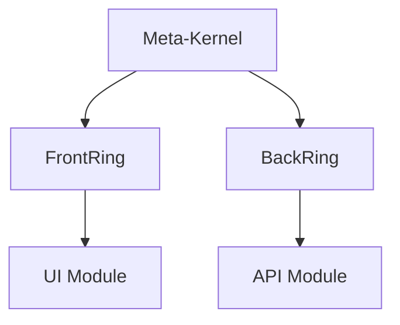

# 🇬🇧 LexOrbital Documentation — English Version

> **An orbital station of modular software architecture, compliant with French law, documented and reusable.**

---

## 🎯 Welcome

This documentation presents **LexOrbital**, a modular web architecture ecosystem designed as an orbital station:

- **Meta-Kernel**: global configuration + laws (GDPR, security)
- **Connection Rings**: standardized front/back interfaces
- **Module-Vessels**: autonomous, replaceable, plug'n'play services

LexOrbital is not just a framework: it's an **architectural methodology** that integrates French and European legal compliance **by design**.

---

## 📚 Navigation by Profile

### 👨‍💼 Product Owner or Project Manager

**Recommended Path:**

1. [Project Overview](./00-introduction/00-overview.md) — Vision, goals, origin
2. [Why LexOrbital?](./00-introduction/01-why-lexorbital.md) — Use cases and benefits
3. [Conceptual Glossary](./00-introduction/02-glossary.md) — Orbital station vocabulary

**Estimated Time:** 15 minutes

---

### 👨‍🔧 Developer

**Recommended Path:**

1. [Quick Start Guide](./03-guides/01-quick-start.md) — Install and launch your first module
2. [Creating a Module](./03-guides/02-creating-a-module.md) — Step-by-step guide
3. [Module Template](https://github.com/YourOrg/lexorbital-template-module) — Reference repository
4. [Manifest Reference](./04-reference/01-module-manifest.md) — Contracts and interfaces

**Estimated Time:** 45 minutes

---

### 🏗️ Software Architect

**Recommended Path:**

1. [Architectural Philosophy](./01-architecture/00-philosophy.md) — Founding principles
2. [The Meta-Kernel](./01-architecture/01-meta-kernel.md) — Legislative and technical core
3. [Orbital Architecture](./01-architecture/02-orbital-pattern.md) — Rings and modules
4. [Integration Patterns](./01-architecture/05-integration-patterns.md) — Git subtree, orchestration
5. [Module Types](./01-architecture/04-module-types.md) — Canonical module catalog

**Estimated Time:** 1h30

---

### 👨‍⚖️ DPO or Compliance Officer

**Recommended Path:**

1. [Compliance Overview](./02-compliance/00-overview.md) — LexOrbital and French law
2. [GDPR by Design](./02-compliance/01-gdpr-by-design.md) — Integrating compliance into architecture
3. [Privacy Patterns](./02-compliance/02-privacy-patterns.md) — Minimization, TTL, encryption
4. [Audit and Logging](./02-compliance/03-audit-logging.md) — Traceability and accountability
5. [LexOrbital GDPR Guide](./02-compliance/GDPR/01_gdpr-guide-lexorbital.md) — Complete reference

**Estimated Time:** 1h

---

## 🗂️ Documentation Structure

### [00 · Introduction](./00-introduction/README.md)

Concepts, philosophy, project origin, glossary.

- [00 - Overview](./00-introduction/00-overview.md)
- [01 - Why LexOrbital?](./00-introduction/01-why-lexorbital.md)
- [02 - Glossary](./00-introduction/02-glossary.md)
- [03 - Origin and Inspiration](./00-introduction/03-origin-story.md)

### [01 · Architecture](./01-architecture/README.md)

Diagrams, patterns, Meta-Kernel, rings, modules.

- [00 - Philosophy](./01-architecture/00-philosophy.md)
- [01 - Meta-Kernel](./01-architecture/01-meta-kernel.md)
- [02 - Orbital Architecture](./01-architecture/02-orbital-pattern.md)
- [03 - Connection Rings](./01-architecture/03-rings.md)
- [04 - Module Types](./01-architecture/04-module-types.md)
- [05 - Integration Patterns](./01-architecture/05-integration-patterns.md)
- [06 - Microservices vs Modules](./01-architecture/06-microservices-vs-modules.md)

### [02 · Compliance & Regulation](./02-compliance/README.md)

GDPR, security, French law, integrated legal patterns.

- [00 - Overview](./02-compliance/00-overview.md)
- [01 - GDPR by Design](./02-compliance/01-gdpr-by-design.md)
- [02 - Privacy Patterns](./02-compliance/02-privacy-patterns.md)
- [03 - Audit and Logging](./02-compliance/03-audit-logging.md)
- [04 - Security by Default](./02-compliance/04-security-by-default.md)
- [05 - User Rights](./02-compliance/05-user-rights.md)
- [GDPR/ — Specialized subfolder](./02-compliance/GDPR/00_SUMMARY.md)

### [03 · Practical Guides](./03-guides/README.md)

Step-by-step tutorials, how-tos, recipes.

- [01 - Quick Start](./03-guides/01-quick-start.md)
- [02 - Creating a Module](./03-guides/02-creating-a-module.md)
- [03 - Integrating an Existing Module](./03-guides/03-integrating-module.md)
- [04 - Git Subtree Workflow](./03-guides/04-git-subtree-workflow.md)
- [05 - CI/CD Setup](./03-guides/05-ci-cd-setup.md)
- [06 - Testing a Module](./03-guides/06-testing-modules.md)
- [07 - Documenting Your Module](./03-guides/07-documenting-modules.md)
- [08 - Deploying with Docker](./03-guides/08-docker-deployment.md)

### [04 · Technical Reference](./04-reference/README.md)

API contracts, JSON schemas, manifests, specifications.

- [01 - Module Manifest](./04-reference/01-module-manifest.md)
- [02 - GDPR Manifest](./04-reference/02-gdpr-manifest.md)
- [03 - API Contracts](./04-reference/03-api-contracts.md)
- [04 - Meta-Kernel Configuration](./04-reference/04-meta-kernel-config.md)
- [05 - Environment Variables](./04-reference/05-environment-variables.md)
- [06 - Hooks and Events](./04-reference/06-hooks-events.md)

### [05 · Contributing](./05-contributing/README.md)

How to participate in the LexOrbital ecosystem.

- [01 - Contribution Guide](./05-contributing/01-contribution-guide.md)
- [02 - Contributing to Documentation](./05-contributing/02-documentation.md)
- [03 - Creating a Community Module](./05-contributing/03-community-modules.md)
- [04 - Coding Standards](./05-contributing/04-coding-standards.md)
- [05 - Review Process](./05-contributing/05-review-process.md)

---

## 🔍 Quick Search

### By Concept

- **Meta-Kernel** → [01-architecture/01-meta-kernel.md](./01-architecture/01-meta-kernel.md)
- **GDPR by Design** → [02-compliance/01-gdpr-by-design.md](./02-compliance/01-gdpr-by-design.md)
- **Git Subtree** → [03-guides/04-git-subtree-workflow.md](./03-guides/04-git-subtree-workflow.md)
- **Module Types** → [01-architecture/04-module-types.md](./01-architecture/04-module-types.md)

### By Task

- **Create a new module** → [03-guides/02-creating-a-module.md](./03-guides/02-creating-a-module.md)
- **Understand the architecture** → [01-architecture/02-orbital-pattern.md](./01-architecture/02-orbital-pattern.md)
- **Verify GDPR compliance** → [02-compliance/01-gdpr-by-design.md](./02-compliance/01-gdpr-by-design.md)
- **Deploy to production** → [03-guides/08-docker-deployment.md](./03-guides/08-docker-deployment.md)

---

## 📖 Reading Conventions

### Callouts and Annotations

> **💡 Tip** — Practical advice and best practices

> **⚠️ Warning** — Important points of caution

> **📘 Definition** — Terminological clarification

> **🔒 Security** — Security considerations

> **⚖️ Legal** — Legal implications (GDPR, French law)

> **🚀 Performance** — Optimizations and performance considerations

### Code Examples

All examples are in **TypeScript** unless otherwise indicated.

```typescript
// Example: module manifest declaration
export const moduleManifest = {
  name: "auth",
  version: "1.0.0",
  type: "back",
  // ...
};
```

### Diagrams

This documentation uses **Mermaid** for diagrams:



---

## 🤝 Contributing to This Documentation

The documentation is living and improves thanks to the community.

- **Fix an error**: open an issue or PR
- **Add an example**: concrete examples are valuable
- **Translate to French**: help us make LexOrbital accessible
- **Improve clarity**: if something is unclear, let us know

See [Documentation Contribution Guide](./05-contributing/02-documentation.md).

---

## 📚 Additional Resources

- [Sources and References](../sources-and-references.md) — Complete bibliography
- [Project Changelog](../../CHANGELOG.md) — Version history
- [Code of Conduct](../../CODE_OF_CONDUCT.md) — Community charter
- [Security Policy](../../SECURITY.md) — Security policy

---

## 🌐 French Version

See the [French documentation](../FR/README.md).

---

<div align="center">

**[⬆️ Back to Top](#-lexorbital-documentation--english-version)**

Made with 🚀 by the LexOrbital community

</div>

