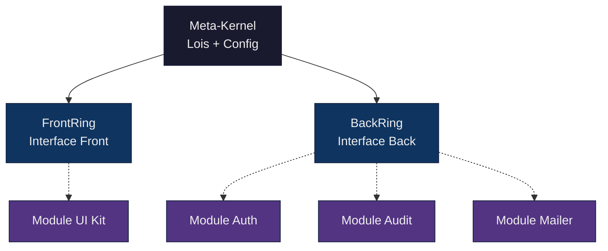

# Vue d'ensemble de LexOrbital

> **LexOrbital : une station orbitale d'architecture logicielle modulaire, conforme au droit français, documentée et réutilisable.**

---

## 🎯 Qu'est-ce que LexOrbital ?

LexOrbital est un **écosystème d'architecture web modulaire** conçu comme une **station orbitale** :

- **Meta-Kernel** au centre : configuration globale + lois (RGPD, sécurité, conventions)
- **Anneaux de connexion** (FrontRing / BackRing) : interfaces standardisées front/back
- **Modules-vaisseaux** : services autonomes, remplaçables, plug'n'play

### En une phrase

> **"Une station orbitale d'architectures web conformes au droit français."**

---

## 🚀 Pourquoi une métaphore orbitale ?

L'architecture est pensée comme un **vaisseau spatial / station orbitale** :



### Les trois niveaux

| Niveau              | Rôle                                            | Métaphore                       |
| ------------------- | ----------------------------------------------- | ------------------------------- |
| **Meta-Kernel**     | Configuration globale, lois (RGPD), conventions | Centre de gravité de la station |
| **Anneaux (Rings)** | Interfaces de connexion front/back              | Anneaux d'amarrage              |
| **Modules**         | Services autonomes (auth, audit, UI...)         | Vaisseaux détachables           |

---

## 🎨 Principes fondateurs

### 1. **Modularité dynamique**

Les modules sont **autonomes et remplaçables**, comme des vaisseaux qui s'arriment à une station.

- Un module peut vivre **sans** LexOrbital (clonable, testable, dockerisable seul)
- L'ajout/retrait d'un module n'affecte pas les autres
- Les modules respectent un **contrat d'interface** (manifest)

### 2. **Conformité by-design**

Le Meta-Kernel intègre le **droit français et le RGPD dès la fondation** :

- Minimisation des données
- Chiffrement par défaut
- Journalisation des opérations sensibles
- TTL (durée de vie) des données
- Droits des utilisateurs (accès, rectification, oubli)

> **⚖️ Légal**  
> LexOrbital ne "rajoute" pas la conformité : il la **structure dans l'architecture**.

### 3. **Simplicité et sécurité**

- **Stack minimaliste** : TypeScript, React, Node.js, PostgreSQL, Docker
- **Peu de dépendances** : seules les libs essentielles
- **Sécurité par défaut** : chiffrement, validation, sanitisation intégrés
- **Documentation complète** : chaque module est documenté

### 4. **Réutilisabilité**

LexOrbital est conçu pour être **un socle réutilisable** :

- Créez un nouveau projet en assemblant des modules existants
- Chaque module suit un **template standardisé** (CI, tests, docs)
- Les modules sont **versionnés** (SemVer) et **publiables** (npm, GitHub Packages)

---

## 🏗️ Architecture en trois couches

### Couche 1 : Meta-Kernel (LexOrbitalCore)

**Rôle :** Définir les lois constitutives du système.

- Configuration globale (secrets, env)
- Règles RGPD (consentement, TTL, chiffrement)
- Contrats d'API (types, schémas)
- Conventions de journalisation
- Patterns de sécurité

> 📘 **Le Meta-Kernel ne "fait" rien** : il définit les règles que tous les modules doivent respecter.

### Couche 2 : Anneaux de connexion (Rings)

**Rôle :** Fournir des interfaces standardisées pour brancher les modules.

#### FrontRing (Interface Front)

- API pour déclarer des modules UI (React components)
- Routing standardisé
- Gestion d'état global (Context / Redux)
- Slots d'intégration (layout, dashboards)

#### BackRing (Interface Back)

- API contractuelle (REST, GraphQL)
- ORM standard (TypeORM, Prisma)
- Middlewares (auth, validation, logs)
- Événements et hooks

### Couche 3 : Modules-vaisseaux

**Rôle :** Implémentations concrètes, autonomes, remplaçables.

Exemples de modules :

| Module                        | Type  | Description                   |
| ----------------------------- | ----- | ----------------------------- |
| `lexorbital-module-auth`      | Back  | Authentification JWT/OAuth    |
| `lexorbital-module-audit`     | Back  | Journalisation RGPD           |
| `lexorbital-module-mailer`    | Back  | Envoi d'emails                |
| `lexorbital-module-ui-kit`    | Front | Composants React standardisés |
| `lexorbital-module-dashboard` | Front | Dashboard générique           |

---

## 🔧 Technologies utilisées

### Core Stack

- **TypeScript** : langage principal (front + back)
- **React** : bibliothèque UI (front)
- **Node.js + Express** : serveur API (back)
- **PostgreSQL** : base de données
- **Docker** : conteneurisation

### Outillage

- **Git Subtree** : intégration des modules dans le projet core
- **Husky + Commitlint** : commits conventionnels
- **ESLint + Prettier** : linting et formatting
- **GitHub Actions** : CI/CD

---

## 📦 Organisation des dépôts

LexOrbital est structuré en **plusieurs repositories GitHub** :

```
lexorbital-core             # Projet fil rouge (front + back + infra)
├── modules/                # Modules intégrés via git subtree
│   ├── auth/
│   ├── audit/
│   └── ...
└── scripts/                # Scripts add-module / update-module

lexorbital-template-module  # Template pour créer un nouveau module

lexorbital-module-auth      # Module autonome (exemple)
lexorbital-module-audit     # Module autonome (exemple)
...
```

> **💡 Astuce**  
> Chaque module vit dans **son propre repo**, puis est intégré dans `lexorbital-core` via **git subtree**.

---

## 🎓 À qui s'adresse LexOrbital ?

### Développeurs

- Vous voulez un **socle réutilisable** pour vos projets SaaS
- Vous cherchez une **architecture modulaire** claire
- Vous voulez éviter de repartir de zéro à chaque projet

### Architectes logiciels

- Vous voulez un **modèle d'architecture** propre et documenté
- Vous cherchez des **patterns d'intégration** éprouvés (subtree, orchestration)
- Vous voulez une **référence** pour structurer vos projets

### DPO / Responsables conformité

- Vous voulez une **architecture conforme RGPD by-design**
- Vous cherchez des **patterns de confidentialité** (minimisation, TTL, audit)
- Vous voulez un **système documenté** pour les audits

### Étudiants et apprenants

- Vous voulez comprendre l'**architecture logicielle moderne**
- Vous cherchez un **projet de référence** bien documenté
- Vous voulez apprendre **Git, Docker, CI/CD** dans un contexte réel

---

## 🚦 Prochaines étapes

### Comprendre l'architecture

➡️ [01 - Architecture : Meta-Kernel, anneaux, modules](../01-architecture/README.md)

### Créer votre premier module

➡️ [03 - Guides : Créer un module](../03-guides/02-creating-a-module.md)

### Vérifier la conformité RGPD

➡️ [02 - Conformité : RGPD by design](../02-compliance/01-rgpd-by-design.md)

---

## 📚 Ressources

- [Glossaire des concepts](./02-glossary.md)
- [Origine du projet](./03-origin-story.md)
- [Template de module](https://github.com/YourOrg/lexorbital-template-module)
- [Sources et références](../../sources-and-references.md)

---

<div align="center">

**[⬅️ Introduction](./README.md)** | **[⬆️ Sommaire](../README.md)** | **[Suivant : Pourquoi LexOrbital ? →](./01-why-lexorbital.md)**

</div>
