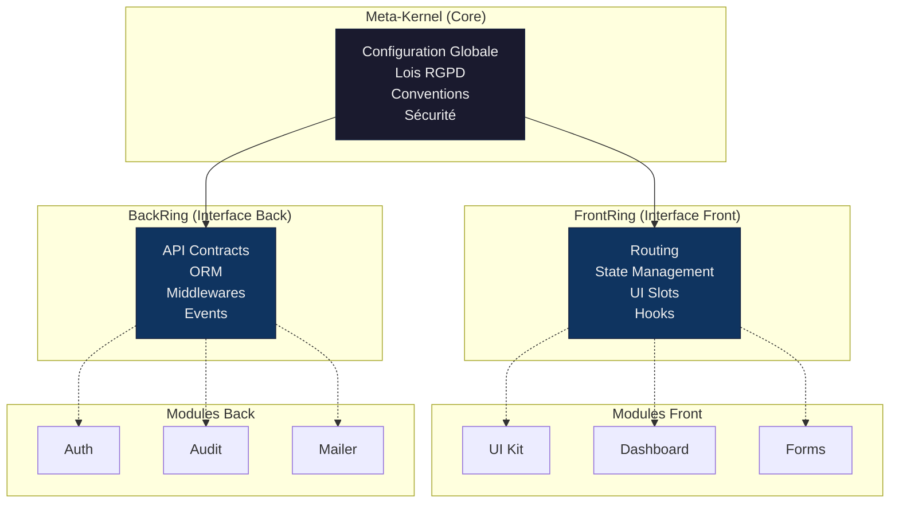

# 01 · Architecture LexOrbital

> **Comprendre l'architecture orbitale : Meta-Kernel, anneaux, modules et patterns d'intégration.**

---

## 📖 Dans cette section

| Document                                                              | Description                               | Niveau     |
| --------------------------------------------------------------------- | ----------------------------------------- | ---------- |
| [**00 - Philosophie**](./00-philosophy.md)                            | Principes architecturaux fondateurs       | Conceptuel |
| [**01 - Meta-Kernel**](./01-meta-kernel.md)                           | Noyau central : lois, config, conventions | Technique  |
| [**02 - Architecture orbitale**](./02-orbital-pattern.md)             | Pattern Station + Anneaux + Modules       | Conceptuel |
| [**03 - Anneaux de connexion**](./03-rings.md)                        | FrontRing, BackRing, interfaces           | Technique  |
| [**04 - Types de modules**](./04-module-types.md)                     | Catalogue des modules canoniques          | Référence  |
| [**05 - Patterns d'intégration**](./05-integration-patterns.md)       | Git subtree, orchestration, déploiement   | Avancé     |
| [**06 - Microservices vs Modules**](./06-microservices-vs-modules.md) | Comparaison et positionnement             | Conceptuel |

---

## 🎯 Objectifs de cette section

Après avoir lu cette section, vous comprendrez :

1. **Les principes** : Pourquoi cette architecture ? Quels problèmes elle résout ?
2. **Le Meta-Kernel** : Rôle, responsabilités, structure
3. **Les anneaux** : Comment les modules se connectent au système
4. **Les modules** : Types, patterns, lifecycle
5. **L'intégration** : Git subtree, Docker, orchestration

---

## 🗺️ Parcours de lecture recommandés

### Parcours "Architecte" (1h30)

1. [Philosophie](./00-philosophy.md) — principes fondateurs
2. [Architecture orbitale](./02-orbital-pattern.md) — vision d'ensemble
3. [Meta-Kernel](./01-meta-kernel.md) — noyau central
4. [Anneaux de connexion](./03-rings.md) — interfaces
5. [Patterns d'intégration](./05-integration-patterns.md) — subtree, orchestration

### Parcours "Développeur" (45 min)

1. [Architecture orbitale](./02-orbital-pattern.md) — vue d'ensemble
2. [Types de modules](./04-module-types.md) — catalogue
3. [Anneaux de connexion](./03-rings.md) — comment brancher un module
4. → Ensuite : [Créer un module](../03-guides/02-creating-a-module.md)

### Parcours "Décideur" (30 min)

1. [Philosophie](./00-philosophy.md) — pourquoi cette architecture ?
2. [Architecture orbitale](./02-orbital-pattern.md) — vision conceptuelle
3. [Microservices vs Modules](./06-microservices-vs-modules.md) — positionnement

---

## 🏗️ Vue d'ensemble de l'architecture

### Schéma conceptuel



### Les trois niveaux

| Niveau              | Rôle       | Responsabilité                                 |
| ------------------- | ---------- | ---------------------------------------------- |
| **Meta-Kernel**     | Législatif | Définir les lois (RGPD, sécurité, conventions) |
| **Anneaux (Rings)** | Interface  | Fournir des points de connexion standardisés   |
| **Modules**         | Exécutif   | Implémenter les fonctionnalités concrètes      |

---

## 📐 Principes architecturaux

### 1. Inversion de dépendances

Les modules **dépendent** des interfaces (anneaux), pas l'inverse.

```typescript
// ❌ Mauvais : le Core dépend des modules
import { AuthModule } from "lexorbital-module-auth"

// ✅ Bon : les modules dépendent du Core
import { BackRing } from "lexorbital-core"
```

### 2. Séparation des responsabilités

- **Meta-Kernel** : lois et configuration
- **Anneaux** : interfaces et contrats
- **Modules** : implémentations

### 3. Modularité et encapsulation

Chaque module est **autonome** :

- Repository indépendant
- Testable seul
- Dockerisable seul
- Publiable seul

### 4. Convention over Configuration

- Structure de dossiers standardisée
- Naming conventions
- Manifests avec schémas par défaut

### 5. Security & Privacy by Design

- Sécurité activée par défaut
- RGPD intégré dans l'architecture
- Chiffrement, validation, sanitisation obligatoires

---

## 🛠️ Technologies et outils

| Couche            | Technologies                      |
| ----------------- | --------------------------------- |
| **Meta-Kernel**   | TypeScript, JSON Schema, dotenv   |
| **FrontRing**     | React, React Router, Context API  |
| **BackRing**      | Express.js, TypeORM, JWT          |
| **Orchestration** | Docker, Docker Compose            |
| **CI/CD**         | GitHub Actions, Husky, Commitlint |
| **Docs**          | Markdown, Mermaid, TypeDoc        |

---

## 🔗 Liens utiles

### Documentation connexe

- [RGPD by design](../02-compliance/01-rgpd-by-design.md)
- [Créer un module](../03-guides/02-creating-a-module.md)
- [Manifest de module](../04-reference/01-module-manifest.md)

### Ressources externes

- [Clean Architecture (Robert C. Martin)](https://blog.cleancoder.com/uncle-bob/2012/08/13/the-clean-architecture.html)
- [Hexagonal Architecture](https://alistair.cockburn.us/hexagonal-architecture/)
- [Plugin Architecture Pattern](<https://en.wikipedia.org/wiki/Plugin_(computing)>)

---

<div align="center">

**[⬅️ Introduction](../00-introduction/README.md)** | **[⬆️ Sommaire](../README.md)** | **[Suivant : Conformité →](../02-compliance/README.md)**

</div>
