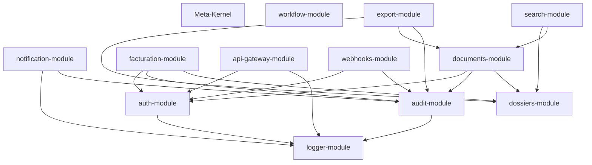

# Architecture des modules types (auth, audit, CI, infra…)

> Catalogue des modules LexOrbital par anneau orbital, avec description, responsabilités et dépendances. Cette fiche sert de référence pour comprendre l'écosystème modulaire de la station.

## 1. Objectif de la fiche

Lister et décrire les modules standards de LexOrbital, leur positionnement dans les anneaux orbitaux, leurs responsabilités et leurs interactions. Cette fiche est la carte stellaire de l'architecture modulaire.

## 2. Modules par anneau orbital

### 2.2. Anneau 1 : Core Services (services transverses)

#### `auth-module`

- **Responsabilité** : Authentification et autorisation
- **Technologies** : Passport.js, JWT, OAuth2
- **Fonctionnalités** :
  - Login/logout (email/password)
  - JWT + refresh tokens
  - OAuth2 (Google, Microsoft)
  - RBAC (Role-Based Access Control)
  - 2FA (TOTP via Authenticator)
- **Dépendances** : `config-module`, `logger-module`
- **Événements émis** : `user.login`, `user.logout`, `token.refreshed`
- **Événements consommés** : `user.created`, `user.deleted`
- **Endpoints** :
  - `POST /auth/login`
  - `POST /auth/refresh`
  - `POST /auth/logout`
  - `GET /auth/me`

#### `audit-module`

- **Responsabilité** : Event sourcing et logs d'audit RGPD
- **Technologies** : EventStoreDB, PostgreSQL (append-only)
- **Fonctionnalités** :
  - Stockage immutable de tous les événements `gdpr.*`
  - Génération du registre RGPD (Art. 30)
  - Recherche/export d'audit trails
  - Hash de chaînage (blockchain-like)
- **Dépendances** : `config-module`, `logger-module`
- **Événements consommés** : `gdpr.*` (tous les événements RGPD)
- **Endpoints** :
  - `GET /audit/events?userId=X`
  - `GET /audit/export?format=pdf`
  - `GET /audit/gdpr-register`

#### `logger-module`

- **Responsabilité** : Logs structurés applicatifs
- **Technologies** : Winston, Loki (ou ELK Stack)
- **Fonctionnalités** :
  - Logs structurés JSON
  - Niveaux : debug, info, warn, error
  - Corrélation par request (trace ID)
  - Agrégation centralisée (Loki/Grafana)
- **Dépendances** : `config-module`
- **Endpoints** : Aucun (service interne uniquement)

#### `notification-module`

- **Responsabilité** : Notifications multi-canaux
- **Technologies** : Nodemailer (email), Twilio (SMS), OneSignal (push)
- **Fonctionnalités** :
  - Envoi d'emails transactionnels (templates)
  - SMS (codes 2FA, alertes)
  - Push notifications (web + mobile)
  - Queue d'envoi avec retry
- **Dépendances** : `config-module`, `logger-module`, `audit-module`
- **Événements consommés** : `user.login`, `dossier.created`, `document.signed`
- **Endpoints** :
  - `POST /notifications/send`
  - `GET /notifications/templates`

### 2.3. Anneau 2 : Business Logic (métier)

#### `documents-module`

- **Responsabilité** : Gestion documentaire (versionning, signatures)
- **Technologies** : NestJS, S3 (stockage), PDFKit, DocuSign
- **Fonctionnalités** :
  - Upload/download de documents
  - Versionning automatique (Git-like)
  - Signature électronique (intégration DocuSign)
  - OCR (extraction de texte via Tesseract)
  - Génération PDF (templates)
- **Dépendances** : `auth-module`, `audit-module`, `dossiers-module`
- **Événements émis** : `document.uploaded`, `document.signed`, `document.downloaded`
- **Événements consommés** : `dossier.created`, `dossier.closed`
- **Endpoints** :
  - `POST /documents/upload`
  - `GET /documents/:id/download`
  - `POST /documents/:id/sign`
  - `GET /documents/:id/versions`

#### `facturation-module`

- **Responsabilité** : Facturation et comptabilité
- **Technologies** : NestJS, Stripe, PDF generation
- **Fonctionnalités** :
  - Génération de factures (templates)
  - Paiements en ligne (Stripe)
  - Export comptable (CSV, FEC)
  - Gestion de la TVA
- **Dépendances** : `auth-module`, `audit-module`, `dossiers-module`
- **Événements émis** : `invoice.created`, `payment.received`
- **Événements consommés** : `dossier.closed`
- **Endpoints** :
  - `POST /invoices`
  - `GET /invoices/:id/pdf`
  - `POST /invoices/:id/pay`

### 2.4. Anneau 3 : Intégrations (APIs externes)

#### `api-gateway-module`

- **Responsabilité** : Exposition REST/GraphQL unifiée
- **Technologies** : NestJS, Apollo (GraphQL)
- **Fonctionnalités** :
  - Routage vers les modules métier
  - Rate limiting (par utilisateur/IP)
  - API versioning (`/v1`, `/v2`)
  - Swagger/OpenAPI automatique
- **Dépendances** : `auth-module`, `logger-module`
- **Endpoints** : Tous les endpoints publics passent par ici

#### `webhooks-module`

- **Responsabilité** : Intégrations tierces (webhooks sortants/entrants)
- **Technologies** : NestJS, Bull (queues)
- **Fonctionnalités** :
  - Webhooks sortants (notifier des services externes)
  - Webhooks entrants (Stripe, DocuSign, Twilio)
  - Retry automatique avec backoff exponentiel
  - Validation de signatures (HMAC)
- **Dépendances** : `auth-module`, `audit-module`
- **Événements consommés** : tous (peut relayer vers externe)
- **Endpoints** :
  - `POST /webhooks/stripe`
  - `POST /webhooks/docusign`

#### `export-module`

- **Responsabilité** : Génération de rapports et exports
- **Technologies** : Puppeteer (PDF), ExcelJS, Pandoc
- **Fonctionnalités** :
  - Export PDF (dossiers, factures, audits)
  - Export Excel (données tabulaires)
  - Export Word (templates de contrats)
  - Génération asynchrone (queue)
- **Dépendances** : `dossiers-module`, `documents-module`, `audit-module`
- **Événements consommés** : `export.requested`
- **Endpoints** :
  - `POST /exports/pdf`
  - `POST /exports/excel`
  - `GET /exports/:id/download`

#### `search-module`

- **Responsabilité** : Recherche full-text avancée
- **Technologies** : ElasticSearch, NestJS
- **Fonctionnalités** :
  - Indexation de dossiers, documents, clients
  - Recherche avec filtres et facettes
  - Autocomplétion
  - Recherche phonétique (noms propres)
- **Dépendances** : `dossiers-module`, `documents-module`
- **Événements consommés** : `dossier.created`, `document.uploaded` (réindexation)
- **Endpoints** :
  - `GET /search?q=contrat&type=dossier`
  - `GET /search/suggest?q=dupon`

## 3. Matrice de dépendances

