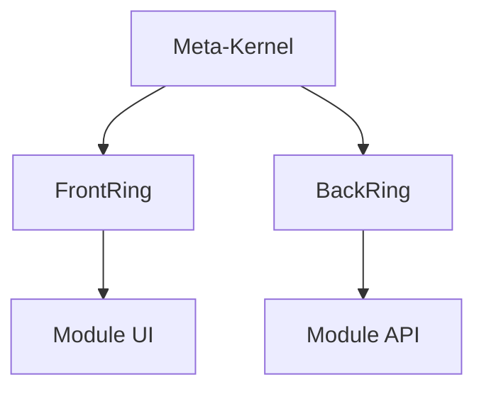

# 🇫🇷 Documentation LexOrbital — Version Française

> **Station orbitale d'architecture logicielle modulaire, conforme au droit français, documentée et réutilisable.**

---

## 🎯 Bienvenue

Cette documentation présente **LexOrbital**, un écosystème d'architecture web modulaire conçu comme une station orbitale :

- **Meta-Kernel** : configuration globale + lois (RGPD, sécurité)
- **Anneaux de connexion** : interfaces front/back standardisées
- **Modules-vaisseaux** : services autonomes, remplaçables, plug'n'play

LexOrbital n'est pas qu'un framework : c'est une **méthodologie architecturale** qui intègre la conformité légale française et européenne **by design**.

---

## 📚 Navigation par profil

### 👨‍💼 Vous êtes Product Owner ou Chef de Projet

**Parcours recommandé :**

1. [Vue d'ensemble du projet](./00-introduction/00-overview.md) — Vision, objectifs, origine
2. [Pourquoi LexOrbital ?](./00-introduction/01-why-lexorbital.md) — Cas d'usage et bénéfices
3. [Glossaire conceptuel](./00-introduction/02-glossary.md) — Vocabulaire de la station orbitale

**Temps estimé :** 15 minutes

---

### 👨‍🔧 Vous êtes Développeur

**Parcours recommandé :**

1. [Guide de démarrage rapide](./03-guides/01-quick-start.md) — Installer et lancer votre premier module
2. [Créer un module](./03-guides/02-creating-a-module.md) — Guide pas-à-pas
3. [Template de module](https://github.com/YourOrg/lexorbital-template-module) — Repository de référence
4. [Référence des manifestes](./04-reference/01-module-manifest.md) — Contrats et interfaces

**Temps estimé :** 45 minutes

---

### 🏗️ Vous êtes Architecte Logiciel

**Parcours recommandé :**

1. [Philosophie architecturale](./01-architecture/00-philosophy.md) — Principes fondateurs
2. [Le Meta-Kernel](./01-architecture/01-meta-kernel.md) — Cœur législatif et technique
3. [Architecture orbitale](./01-architecture/02-orbital-pattern.md) — Anneaux et modules
4. [Patterns d'intégration](./01-architecture/05-integration-patterns.md) — Git subtree, orchestration
5. [Types de modules](./01-architecture/04-module-types.md) — Catalogue des modules canoniques

**Temps estimé :** 1h30

---

### 👨‍⚖️ Vous êtes DPO ou Responsable Conformité

**Parcours recommandé :**

1. [Conformité : vue d'ensemble](./02-compliance/00-overview.md) — LexOrbital et le droit français
2. [RGPD by design](./02-compliance/01-rgpd-by-design.md) — Intégration de la conformité dans l'architecture
3. [Patterns de confidentialité](./02-compliance/02-privacy-patterns.md) — Minimisation, TTL, chiffrement
4. [Audit et journalisation](./02-compliance/03-audit-logging.md) — Traçabilité et responsabilité
5. [Guide RGPD LexOrbital](./02-compliance/RGPD/01_guide-rgpd-lexorbital.md) — Référence complète

**Temps estimé :** 1h

---

## 🗂️ Structure de la documentation

### [00 · Introduction](./00-introduction/README.md)

Concepts, philosophie, origine du projet, glossaire.

- [00 - Vue d'ensemble](./00-introduction/00-overview.md)
- [01 - Pourquoi LexOrbital ?](./00-introduction/01-why-lexorbital.md)
- [02 - Glossaire](./00-introduction/02-glossary.md)
- [03 - Origine et inspiration](./00-introduction/03-origin-story.md)

### [01 · Architecture](./01-architecture/README.md)

Diagrammes, patterns, Meta-Kernel, anneaux, modules.

- [00 - Philosophie](./01-architecture/00-philosophy.md)
- [01 - Meta-Kernel](./01-architecture/01-meta-kernel.md)
- [02 - Architecture orbitale](./01-architecture/02-orbital-pattern.md)
- [03 - Anneaux de connexion](./01-architecture/03-rings.md)
- [04 - Types de modules](./01-architecture/04-module-types.md)
- [05 - Patterns d'intégration](./01-architecture/05-integration-patterns.md)
- [06 - Microservices vs Modules](./01-architecture/06-microservices-vs-modules.md)

### [02 · Conformité & Réglementation](./02-compliance/README.md)

RGPD, sécurité, droit français, patterns juridiques intégrés.

- [00 - Vue d'ensemble](./02-compliance/00-overview.md)
- [01 - RGPD by design](./02-compliance/01-rgpd-by-design.md)
- [02 - Patterns de confidentialité](./02-compliance/02-privacy-patterns.md)
- [03 - Audit et journalisation](./02-compliance/03-audit-logging.md)
- [04 - Sécurité par défaut](./02-compliance/04-security-by-default.md)
- [05 - Droits des utilisateurs](./02-compliance/05-user-rights.md)
- [RGPD/ — Sous-dossier spécialisé](./02-compliance/RGPD/00_SOMMAIRE.md)

### [03 · Guides Pratiques](./03-guides/README.md)

Tutoriels pas-à-pas, how-to, recettes.

- [01 - Démarrage rapide](./03-guides/01-quick-start.md)
- [02 - Créer un module](./03-guides/02-creating-a-module.md)
- [03 - Intégrer un module existant](./03-guides/03-integrating-module.md)
- [04 - Workflow Git subtree](./03-guides/04-git-subtree-workflow.md)
- [05 - Configurer la CI/CD](./03-guides/05-ci-cd-setup.md)
- [06 - Tester un module](./03-guides/06-testing-modules.md)
- [07 - Documenter votre module](./03-guides/07-documenting-modules.md)
- [08 - Déployer avec Docker](./03-guides/08-docker-deployment.md)

### [04 · Référence Technique](./04-reference/README.md)

Contrats d'API, schémas JSON, manifestes, spécifications.

- [01 - Manifest de module](./04-reference/01-module-manifest.md)
- [02 - Manifest RGPD](./04-reference/02-rgpd-manifest.md)
- [03 - Contrats d'API](./04-reference/03-api-contracts.md)
- [04 - Configuration Meta-Kernel](./04-reference/04-meta-kernel-config.md)
- [05 - Variables d'environnement](./04-reference/05-environment-variables.md)
- [06 - Hooks et événements](./04-reference/06-hooks-events.md)

### [05 · Contribuer](./05-contributing/README.md)

Comment participer à l'écosystème LexOrbital.

- [01 - Guide de contribution](./05-contributing/01-contribution-guide.md)
- [02 - Contribuer à la documentation](./05-contributing/02-documentation.md)
- [03 - Créer un module communautaire](./05-contributing/03-community-modules.md)
- [04 - Standards de code](./05-contributing/04-coding-standards.md)
- [05 - Review et approbation](./05-contributing/05-review-process.md)

---

## 🔍 Recherche rapide

### Par concept

- **Meta-Kernel** → [01-architecture/01-meta-kernel.md](./01-architecture/01-meta-kernel.md)
- **RGPD by design** → [02-compliance/01-rgpd-by-design.md](./02-compliance/01-rgpd-by-design.md)
- **Git subtree** → [03-guides/04-git-subtree-workflow.md](./03-guides/04-git-subtree-workflow.md)
- **Modules types** → [01-architecture/04-module-types.md](./01-architecture/04-module-types.md)

### Par tâche

- **Créer un nouveau module** → [03-guides/02-creating-a-module.md](./03-guides/02-creating-a-module.md)
- **Comprendre l'architecture** → [01-architecture/02-orbital-pattern.md](./01-architecture/02-orbital-pattern.md)
- **Vérifier la conformité RGPD** → [02-compliance/01-rgpd-by-design.md](./02-compliance/01-rgpd-by-design.md)
- **Déployer en production** → [03-guides/08-docker-deployment.md](./03-guides/08-docker-deployment.md)

---

## 📖 Conventions de lecture

### Callouts et annotations

> **💡 Astuce** — Conseils pratiques et bonnes pratiques

> **⚠️ Attention** — Points de vigilance importants

> **📘 Définition** — Clarification terminologique

> **🔒 Sécurité** — Considérations de sécurité

> **⚖️ Légal** — Implications juridiques (RGPD, droit français)

> **🚀 Performance** — Optimisations et considérations de performance

### Diagrammes

Cette documentation utilise **Mermaid** pour les diagrammes :

---

## 🤝 Contribuer à cette documentation

La documentation est vivante et s'améliore grâce à la communauté.

- **Corriger une erreur** : ouvrez une issue ou une PR
- **Ajouter un exemple** : les exemples concrets sont précieux
- **Traduire en anglais** : aidez-nous à rendre LexOrbital accessible
- **Améliorer la clarté** : si quelque chose n'est pas clair, dites-le

Voir [Guide de contribution à la documentation](../CONTRIBUTING.md).

---

## 📚 Ressources complémentaires

- [Sources et références](./04-reference/sources-and-references.md) — Bibliographie complète
- [Changelog du projet](../../CHANGELOG.md) — Historique des versions
- [Code of Conduct](../../CODE_OF_CONDUCT.md) — Charte de la communauté
- [Security Policy](../../SECURITY.md) — Politique de sécurité

---

**[⬆️ Retour en haut](#-documentation-lexorbital--version-française)**

Fait avec 🚀 par la communauté LexOrbital

