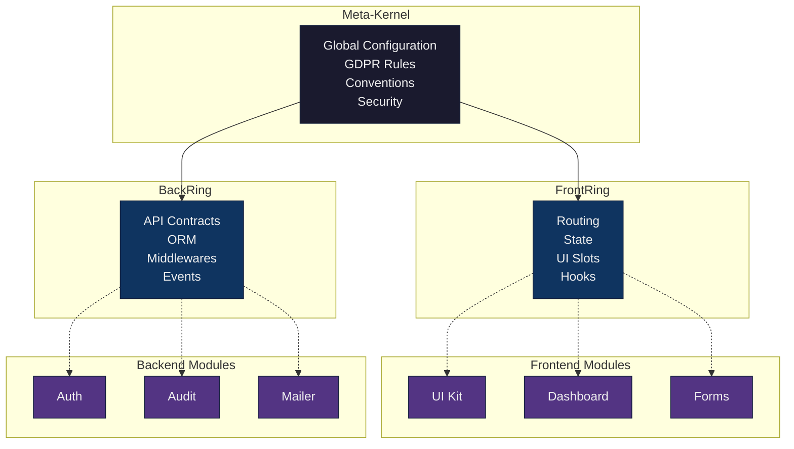
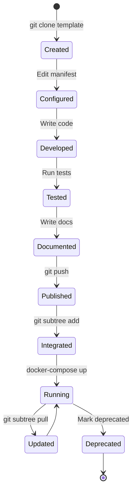
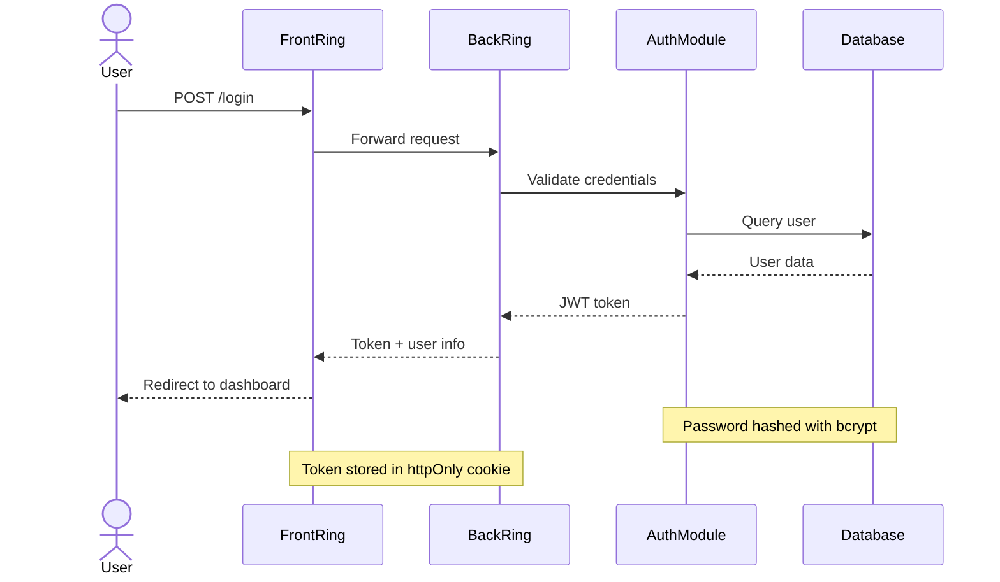

# 🎨 Diagrams and Visual Resources

> **Collection of diagrams, schematics, and illustrations for understanding the LexOrbital architecture.**

---

## 📁 Structure

```
diagrams/
├── architecture/      # Architecture diagrams
├── flows/             # Workflow diagrams
└── concepts/          # Concept illustrations
```

---

## 🗂️ Available Diagrams

### Architecture

| Diagram              | Description                     | Format  | File                                |
| -------------------- | ------------------------------- | ------- | ----------------------------------- |
| **Orbital Station**  | Overview of the orbital station | Mermaid | `architecture/orbital-station.mmd`  |
| **Meta-Kernel**      | Meta-Kernel structure           | Mermaid | `architecture/meta-kernel.mmd`      |
| **Rings & Modules**  | Rings and module connections    | Mermaid | `architecture/rings-modules.mmd`    |
| **Module Lifecycle** | Module lifecycle stages         | Mermaid | `architecture/module-lifecycle.mmd` |

### Flows

| Diagram                 | Description                | Format  | File                            |
| ----------------------- | -------------------------- | ------- | ------------------------------- |
| **Module Registration** | Module onboarding workflow | Mermaid | `flows/module-registration.mmd` |
| **User Authentication** | Login flow                 | Mermaid | `flows/user-auth-flow.mmd`      |
| **GDPR Data Request**   | User data request workflow | Mermaid | `flows/rgpd-data-request.mmd`   |
| **Git Subtree Update**  | Updating via git subtree   | Mermaid | `flows/git-subtree-update.mmd`  |

### Concepts

| Diagram               | Description                    | Format | File                             |
| --------------------- | ------------------------------ | ------ | -------------------------------- |
| **Orbital Metaphor**  | Orbital station metaphor       | Image  | `concepts/orbital-metaphor.png`  |
| **Module Vessel**     | Module-as-vessel concept       | Image  | `concepts/module-vessel.png`     |
| **Docking Mechanism** | Docking mechanism illustration | Image  | `concepts/docking-mechanism.png` |

---

## 🖼️ Previews

### Orbital Station (Overview)



### Module Lifecycle



### User Authentication Flow



---

## 🛠️ Tools in Use

### Mermaid

- Technical diagrams (architecture, flows, sequences).

- **Docs:** https://mermaid.js.org/

---

### Excalidraw

- Conceptual illustrations.

- **Link:** https://excalidraw.com/

- **Export:** PNG or SVG

---

### PlantUML

- Complex UML diagrams.

- **Docs:** https://plantuml.com/

---

## 📝 Conventions

### File naming

- **Kebab-case:** `module-lifecycle.mmd`
- **Descriptive:** name reflects content
- **Proper extension:** `.mmd` (Mermaid), `.png`, `.svg`, `.puml` (PlantUML)

### Colors

- LexOrbital palette (inspired by orbital/spatial themes):

| Element         | Color       | Hex       |
| --------------- | ----------- | --------- |
| **Meta-Kernel** | Deep navy   | `#1a1a2e` |
| **Rings**       | Medium blue | `#0f3460` |
| **Modules**     | Purple      | `#533483` |
| **Connections** | Cyan        | `#16c79a` |
| **Alerts**      | Orange      | `#e94560` |

### Style

- **Minimalist:** avoid visual clutter
- **Functional:** the diagram should inform, not decorate
- **Consistent:** reuse shapes for the same concepts
- **Accessible:** ensure strong contrast and legible text

---

## 🤝 Contribute

### Add a new diagram

1. Create the file in the appropriate folder (`architecture/`, `flows/`, `concepts/`)
2. Follow the naming conventions
3. Add an entry to this README
4. Validate rendering (Mermaid Live Editor, etc.)
5. Commit with: `docs: add diagram [name]`

### Update a diagram

1. Modify the source file
2. Regenerate exports if needed
3. Update last modified date
4. Commit with: `docs: update diagram [name]`

---

## 📚 Resources

- [Mermaid Live Editor](https://mermaid.live/)
- [Excalidraw](https://excalidraw.com/)
- [PlantUML Online](http://www.plantuml.com/plantuml/uml/)
- [C4 Model](https://c4model.com/) — architecture diagrams
- [Structurizr](https://structurizr.com/) — software architecture diagrams

---

<div align="center">

**[⬆️ Back to Docs](../README.md)**

</div>
